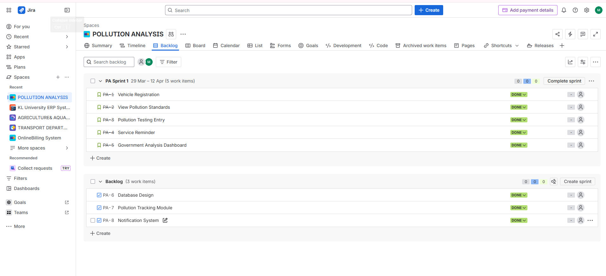
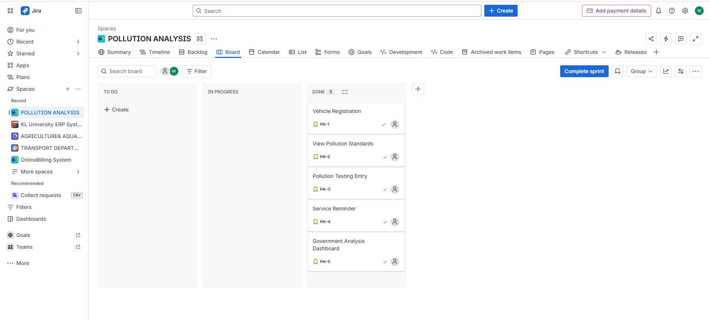
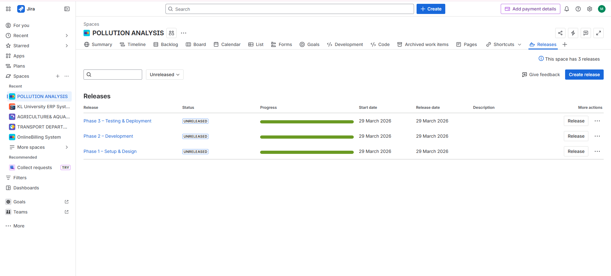
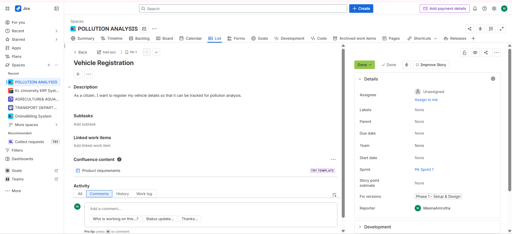

**Pollution-Analysis-System**
Scrum-based project for pollution analysis
**Pollution Analysis System**

**Description**

This project analyzes pollution caused by land transportation vehicles using Scrum methodology.

**Features**

* Vehicle registration
* Pollution tracking
* Service reminders
* Government analysis dashboard

**Scrum Details**

* User Stories: 5
* Issues: 3
* Milestones: 3

**User Stories & Milestones Mapping**
* Phase 1 – Setup & Design → Story 1, Story 2
* Phase 2 – Development → Story 3, Story 4
* Phase 3 – Testing & Deployment → Story 5

## Screenshots

